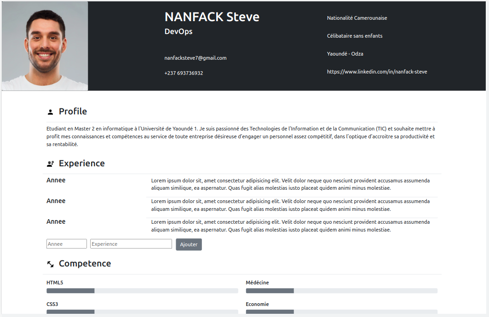
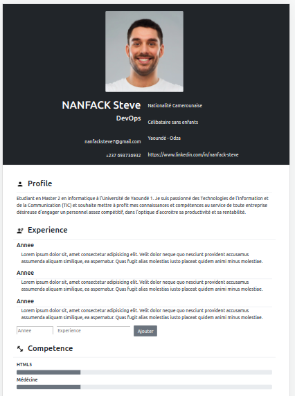

# Dynamic Curriculum Vitae

Lab on designing a Dynamic Resume with <b>Bootstrap</b> and <b>JavaScript</b>

You can visit the web page [here](https://nanfacksteve.github.io/TWF_TP_CV/)  

<!--  -->
